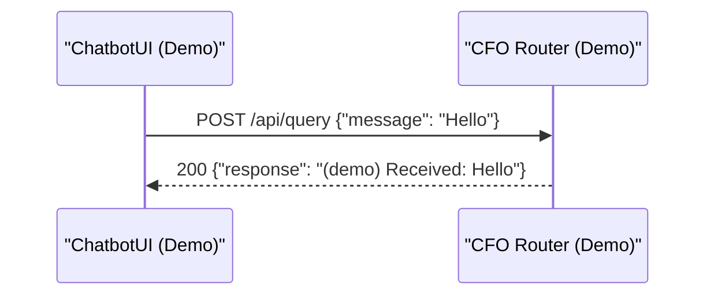
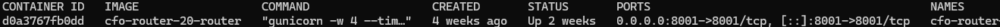
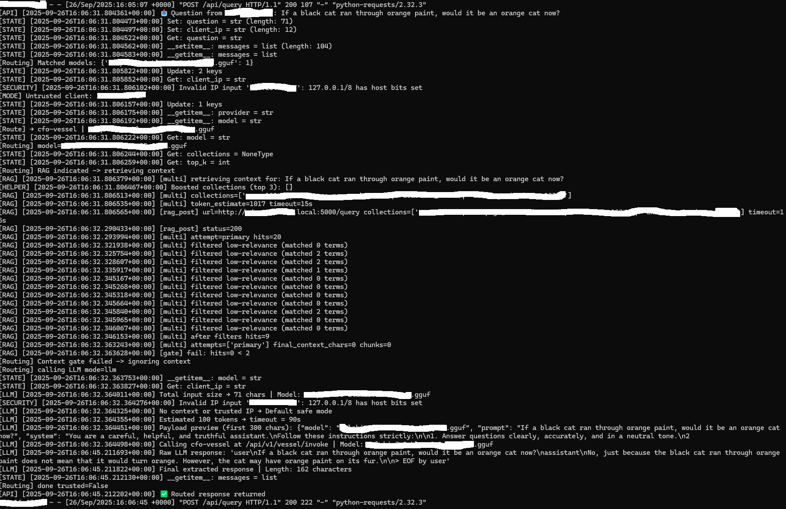
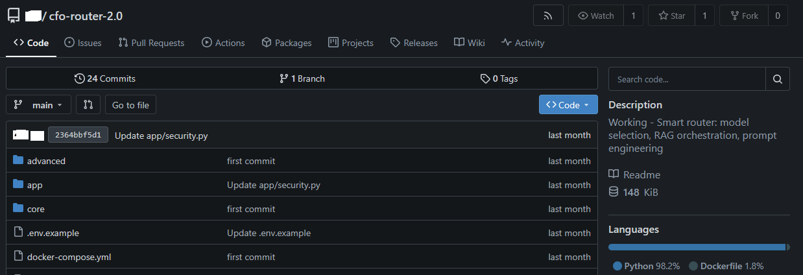

# CFO Router (Demo)

A **public-safe demo** of the CFO Router. This service accepts chat queries and returns
a canned response for demonstration. It does **not** call external model providers,
and it excludes private integrations, prompts, or routing logic.

---

## 🔹 Quick Start

### Run with Docker
```bash
docker build -t cfo-router-demo .
docker run --rm -p 8001:8001 cfo-router-demo
````

### Or with docker-compose (local only)

```bash
docker compose -f docker-compose.example.yml up --build
```

### Test

```bash
curl -s -X POST http://localhost:8001/api/query \
  -H "Content-Type: application/json" \
  -d '{"message":"Hello"}'
```

---

## 🔹 API

* `GET /api/healthz` -> `{"status":"ok"}`
* `POST /api/query` -> `{"response":"(demo) Received: ...", "meta": {...}}`

---

## 🔹 Sequence



**Explanation:** UI posts a message to the demo router and receives a canned response. No model calls.

---

## 🔹 Demo Screenshots

Screenshots from a local test environment (sensitive details redacted):

* **Docker container running**
  

* **Router logs processing a query**
  

  ---

  ## 🔹 Private Gitea Screenshot

  Screenshot from local private Gitea repo (sensitive details redacted):

  * **cfo-router repo**

  

---

## 🔹 Disclaimer

See [DISCLAIMER.md](./DISCLAIMER.md). This is a demo-only repository.
Full production implementations remain private.

## 🔹 Security

See [SECURITY.md](./SECURITY.md). Do not expose demo services to the internet.

## 🔹 License

All Rights Reserved. See [LICENSE.md](./LICENSE.md).

